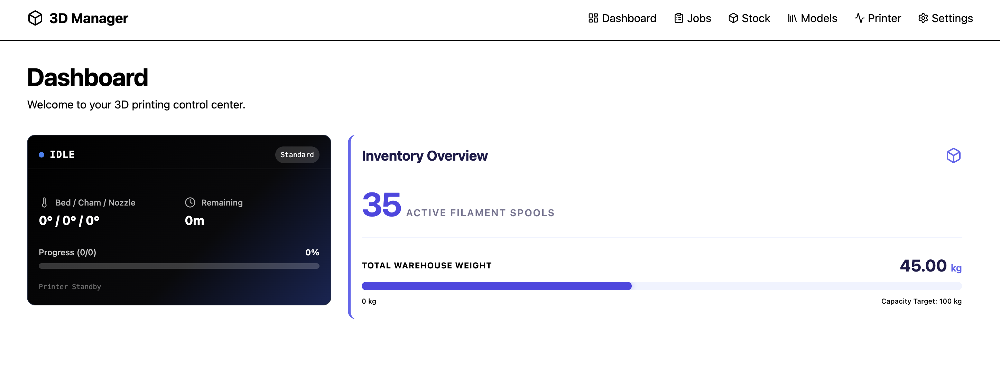
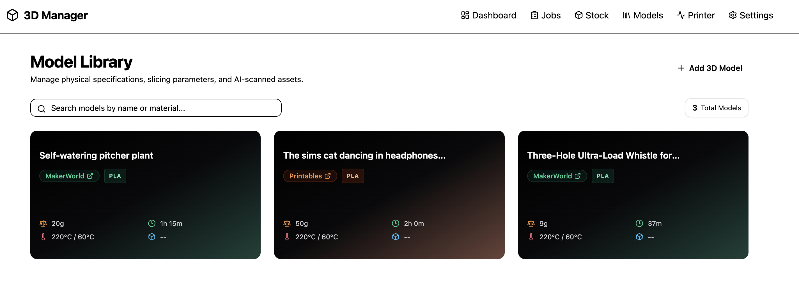
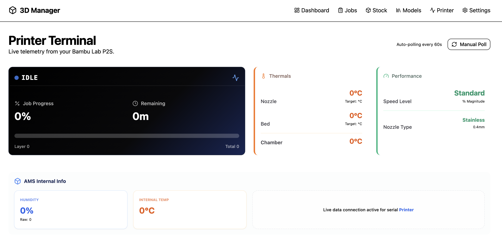
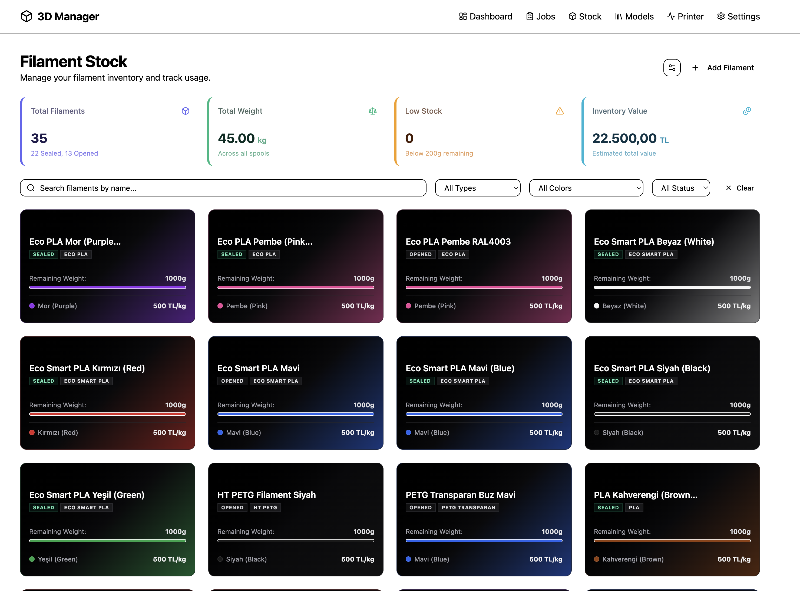
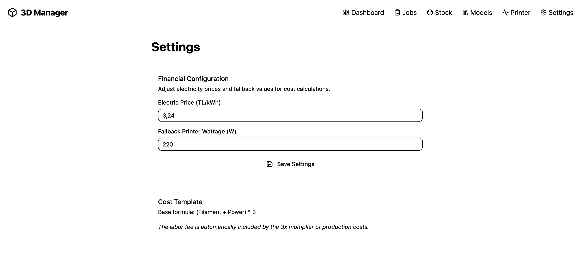

# 🚀 3D Management App

A premium, comprehensive management system for 3D printing workflows, specifically optimized for **Bambu Lab P2S** printers. This application streamlines inventory management, print job tracking, and cost calculation with a sleek, modern interface.

## 📸 Visual Showcase

### 📊 Dashboard Control Center


*Real-time control center featuring state-aware printer monitoring widgets and automated capacity gauges.*

### 📦 3D Model Library & AI Spec Scanner


*Decoupled library managing dynamic specifications with multi-provider AI scanning grids (Gemini, Claude, OpenAI, Ollama).*

### 📡 Printer Terminal Telemetry


*Obsidian-black dynamic terminal card showing job progress, thermals, speed performance, and AMS feedback.*

### 🎨 Filament Stock Tab


*Unified inventory overview showing weight summaries, color hex swatches, custom glows, and warning threshold states.*

### 🛠️ System Control Settings


*System-wide customizable parameters, brands, standard density indices, and active MQTT topics.*

## ✨ Features

- **Inventory 2.0**: Normalized tracking of filaments by type, color (with hex swatches), and status.
- **Model Library**: Complete management of 3D slicing parameters, physical specifications, and assets.
- **AI-Assisted Specs & Scanners**: Automatically extract technical specs (estimated weight, print time, bed/nozzle temperatures, dimensions) using cloud APIs (Gemini, Claude, OpenAI) or fully local models via Ollama (`qwen3.5` & `gemma4`). Includes fallback scraping using Firecrawl or Playwright browser automation!
- **Premium Platform Styling**: Sourced models from **MakerWorld** and **Printables** feature gorgeously styled custom card layouts with black-and-emerald / black-and-orange neon gradients, micro-borders, glowing icons, and clean white text.
- **Multi-Printer Registry & Fleet Control (New)**: Cluster and monitor multiple network-connected Bambu Lab printers simultaneously. Features dynamic, state-aware telemetry dashboards detailing nozzle/bed temperatures, mechanical speed multipliers, progress percentages, active layer heights, and AMS configurations. Includes connection response health checks and toggleable credential masking for enhanced privacy.
- **Real-time MQTT Tracking**: Persistent background listeners that subscribe to and parse telemetry channels from active printer spools.
- **Smart Cost Engine**: Calculates total production cost based on electricity, power usage, and filament price with customizable markups.
- **Modular Settings**: Manage filament types, colors, and system-wide inventory defaults.
- **Page-Based Interactive Privacy Mode & Database Presets (New)**: Configure which elements to show or mask dynamically by entering visual configuration mode directly on any page. Select layout columns, telemetry data, or financial summaries interactively. Save named privacy presets to the backend SQLite database to easily swap preset profiles later.

## 🏗 Architecture

The project is built with a modern, decoupled architecture:

- **Frontend**: [React 19](frontend/README.md) + [Vite](frontend/README.md) + [Tailwind 4](frontend/README.md)
- **Backend**: [FastAPI](backend/README.md) + [SQLModel](backend/README.md) + [Alembic](backend/alembic/) + [PostgreSQL](backend/README.md)
- **Infrastructure**: [Docker Compose](docker-compose.yml)

## 🔒 Security & Container Hardening

- **Non-Root Execution**: Both frontend and backend Docker containers are hardened to run as non-root users (`nginx` and `appuser` respectively) to satisfy modern security policies and CIS container image benchmarks.
- **Unprivileged Ports**: The Nginx frontend server now runs on unprivileged internal port `8080` (mapped to port `3000` on the host).
- **CORS Protection**: Access control origins are restricted to standard development hosts (`http://localhost:3000`, `http://localhost:5173`, and `127.0.0.1` equivalents) to block cross-origin request forgery.
- **Base OS & Library Security**: Container base OS libraries are updated automatically during the build process, and python packages (such as `urllib3` for CVE-2023-45853) are pinned to safe versions.
- **Trivy Audited**: Scanned and verified clean using `trivy` for both package dependencies and Docker configuration rules.

## ⚡ Resource & Performance Hardening

- **File Descriptor Leak Prevention**: All API file uploads cleanly close their respective OS file streams after processing, mitigating memory/FD leakage during high-frequency screenshot parsing.
- **Client Connection Reuse**: Global AI model clients (such as the Ollama `AsyncClient`) are initialized once and recycled across extraction requests, minimizing TCP socket overhead.
- **Clean Coroutine Shutdown**: Background polling listeners are gracefully cancelled and awaited during ASGI lifespan shutdown, preventing unhandled background execution warnings.
- **Test-Suite Optimization**: Unit and integration test assertions utilize async selectors (`findByText`) rather than static timeouts, eliminating React `act(...)` warning traces entirely.

## 🚀 Quick Start

### 🐳 Option 1: Running with Docker (Recommended)

```bash
docker compose up --build -d
```

The application will be available at:

- **Frontend**: `http://localhost:3000`
- **Backend API**: `http://localhost:8000`
- **API Docs**: `http://localhost:8000/docs`

### 💻 Option 2: Running Locally (Without Docker)

This is often faster for active development.

**1. Backend Setup:**

```bash
cd backend
# Create/Edit .env: DATABASE_URL=sqlite:///./3d_management.db
uv sync
uv run uvicorn app.main:app --reload --port 8001
```

**2. Frontend Setup:**

```bash
cd frontend
bun install
bun run dev
```

The local dev app will be at `http://localhost:5173`.

## 🛠 Development

For detailed development instructions, please refer to the sub-project READMEs:

- 🐍 [Backend Development](backend/README.md)
- ⚛️ [Frontend Development](frontend/README.md)

## 🗺️ Roadmap & Operational Vision

We have structured our expansion strategy into logical, high-impact development cycles designed to turn this tool into the ultimate smart 3D printing workshop hub.

### Done & Delivered 🚀
*   **[x] Phase 1: Core Inventory & Color normalization (Completed)**
    *   *Features*: Complete relational database schema tracking filament spools, automatic consumption tallies, color hex swatches, custom threshold limits, and low-stock alarms. Included modular global settings.
*   **[x] Phase 2: Asynchronous MQTT Telemetry Services (Completed)**
    *   *Features*: Real-time IoT background listener subscribing to and parsing telemetry data from active printer spools. Displays live nozzle/bed temperatures, speed profiles, and AMS humidity metrics.
*   **[x] Phase 3: AI Slicing Spectrometer & Web Scraper (Completed)**
    *   *Features*: Decoupled 3D Model Library with drag-and-drop vision scanning (multipart images) and automated link scraping (Playwright + Firecrawl). Supported by Gemini, Claude, OpenAI, and local Ollama (`qwen3.5` & `gemma4`) model extractions. Gorgeously themed MakerWorld (green-glow) and Printables (orange-glow) provider cards.
*   **[x] Phase 4: Multi-Printer Registry & Fleet Control (Completed)**
    *   *Features*: Dynamic registration and lifecycle management of multiple Bambu Lab printers. Master-Detail dashboard view with active state badges, consolidated background polling loops, connection response health checks, and toggleable credential masking for IP and Serial Numbers.
*   **[x] Phase 5: Overwhelming Privacy Mode & Page Loading Skeletons (Completed)**
    *   *Features*: Extended global visual visibility toggling across the app layout (logo, titles, links, individual details). Interactive dual-listbox configuration menu on Settings page for granular control (including Date, Type, Filaments, and Duration on Jobs tab). Tailored, layout-aware shimmer skeleton screens for all pages.

### Upcoming Milestones 🔮
*   **[ ] Phase 6: Advanced Cost Analytics & Production Reporting (Active)**
    *   *Energy Tracking*: Join active print job duration profiles with local utility kWh pricing grids to compute precise real-time electrical overheads.
    *   *Automated Depletion*: Automatically decrement spool remaining weights upon successful print job execution, updating the warehouse log.
    *   *ROI Margins Deck*: Interactive graphs comparing raw material costs (filament + wear + electricity) against sales value to chart operational return on investment.
    *   *Print Reports*: Exportable PDF print logs documenting filament color distributions, monthly production volumes, and machine failure frequencies.
*   **[ ] Phase 7: Smart Print Queue & dispatching**
    *   *Global Queue Deck*: A centralized priority-ranked spool queue. Queue up sliced files, set print priorities, and route tasks to idle nodes.
    *   *Color-Matching Dispatcher*: Auto-assign prints to nodes based on matching active AMS slots with the material requirements parsed by our AI spectrometer.
    *   *Maintenance Logbook*: Monitor component wear (nozzle, lead screws, belt tension profiles) prompting custom maintenance alerts based on active operating run-times.
*   **[ ] Phase 8: PWA Mobile Companion & Push Notifications**
    *   *Mobile PWA*: Desktop-matching, ultra-fluid Progressive Web App featuring offline caching profiles and simple native home-screen installation.
    *   *Real-time Push Alerts*: Push notification system informing the user's mobile device of failure warnings (filament depletion, chamber overheating) or successful job finishes.
    *   *Low-latency Webcams*: Direct integration of printer camera streams inside the dashboard layout using secure, low-latency HLS or WebRTC feeds.

## 📄 Changelog

For a detailed history of all code, API, and UI changes sorted by date, please check the [Changelog](CHANGELOG.md).

## 🤝 Contributing

1. Fork the project.
2. Create your Feature Branch (`git checkout -b feature/AmazingFeature`).
3. Commit your changes (`git commit -m 'Add some AmazingFeature'`).
4. Push to the Branch (`git push origin feature/AmazingFeature`).
5. Open a Pull Request.

## 📝 License

Distributed under the Apache License 2.0. See `LICENSE` for more information.
